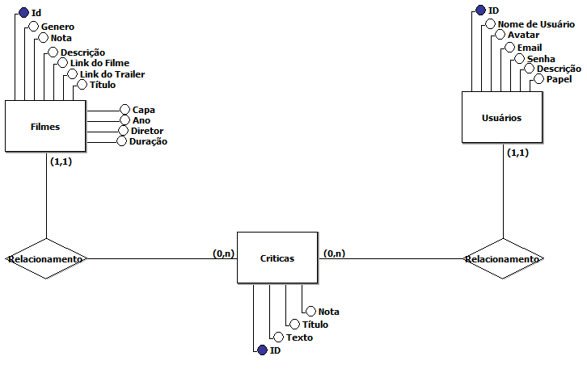

# Kult
## Diagrama Entidade e Relacionamento


## Executando Projeto
1. Mudar para diretório back-end.

```
cd back-end
```

2. instalar dependencias.

```
npm install
```

3. Criar um arquivos .env no diretório back-end.
4. Iniciar um banco de dados SQL.
5. No arquivo inserir o seguinte código.
```
DBUSER=nomeDB
DBPASS=senhaDB
DBNAME=usuarioDB
SECRET=padrao
```
6. Substituir os "nomeDB"/"senhaDB"/"usuarioDB" pelos respectivos dados referentes ao seu banco de dados SQL.
7. Substituir "padrao" por uma senha para ser utilizado como padrão de codigicação e decodificação de Tokens.
8. Gerar seu proprio link caso seja necessário.
9. Mudar para diretório de reactapp.
```
cd ..
```
```
cd appreact
```
10. Instalar dependencias
```
npm i
```
11. Executar projeto
```
npm start
```

## Prints do Projeto
### Home


